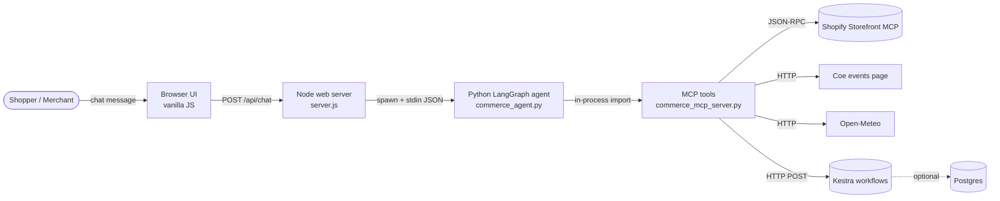

# Storefront Concierge

A chat-based shopping concierge and **Campus Demand Radar** for Shopify storefronts. The chat agent searches a live Shopify catalog over the [Storefront MCP](https://shopify.dev/docs/api/mcp), builds a real cart, and hands off to Shopify checkout. The Demand Radar mashes up campus events, weather, recent shopper intent, and live inventory to tell a merchant what to feature this week — and triggers a [Kestra](https://kestra.io) workflow to act on it.

> **Showcase store:** [The Kohawk Shop](https://thekohawkshop.com) (Coe College, Cedar Rapids, IA)

---

## What this demonstrates

- **An agentic chat surface that does real merchant work** — not a toy demo. Search → cart → checkout, all wired to a live Shopify store.
- **MCP as a clean tool boundary.** The agent calls the same tool functions that an external MCP client (Claude Desktop, etc.) could call.
- **A LangGraph state machine with a deterministic fallback.** The graph runs the same path whether `langgraph` is installed or not, so the demo always boots.
- **Workflow handoff at the merchant layer.** Shopify owns checkout, payment, tax, and order creation. After `orders/paid`, Kestra picks up — fulfillment, comms, alerts, demand-radar reporting.
- **A multi-source signal mash-up** the way real merchandising teams want it — public web (campus calendar) + weather + first-party intent + commerce inventory.

## Architecture



Postgres and Kestra are optional — the chat works without them.

## What's real vs. what's mocked

| Capability | Status | Notes |
|---|---|---|
| Live Shopify catalog search | Real | `SHOPIFY_STORE_DOMAIN=thekohawkshop.com` calls Shopify's Storefront MCP |
| Live Shopify cart + checkout URL | Real | Returned by the same MCP endpoint |
| Local demo catalog fallback | Real | `data/catalog.json`, used if no Shopify domain configured |
| LangGraph state machine | Real if `langgraph` installed; otherwise deterministic fallback runs the same nodes |
| Coe College events signal | Real | Scrapes the public events calendar |
| Cedar Rapids weather signal | Real | Open-Meteo public API |
| Shopper intent signal | Real | Aggregated from the in-session intent log |
| Kestra post-order automation | Real workflow trigger; needs `docker compose up kestra` to actually run |
| Shopify `orders/paid` webhook | **Simulated** by the "Simulate order paid" button — proves the handoff shape, not a real webhook |
| Postgres schema | Real init scripts in `db/init/` for when you wire up persistence |

## Quick start

```bash
# 1. Local catalog mode (no external services)
npm start
# → http://localhost:3000

# 2. Live Shopify mode (Kohawk Shop)
SHOPIFY_STORE_DOMAIN=thekohawkshop.com npm start

# 3. Optional: turn on Postgres + Kestra for the full radar workflow demo
docker compose up -d
# Kestra UI at http://localhost:8080, Postgres at localhost:5432
```

Try these prompts in the chat:

- `Find a hoodie for an alum`
- `Find waterproof trail shoes under $150` _(local catalog mode)_
- `Add the best option to my cart`
- `Checkout in Shopify`
- `Run campus opportunity scan` ← the radar demo
- `Simulate order paid` ← triggers the Kestra post-order workflow

### Run the agent from the terminal (no UI)

```bash
npm run agent:demo
```

### Tests

```bash
npm test
```

The contract tests run the agent end-to-end against the local catalog path — no external services required.

## Project shape

```
server.js                          Node web/API server (no framework)
public/                            Browser UI (vanilla HTML/CSS/JS)
agent/commerce_agent.py            LangGraph agent entry point
agent/mcp/commerce_mcp_server.py   MCP tools (importable + JSON-RPC entry)
data/catalog.json                  Local demo catalog
db/init/001_schema.sql             Postgres schema and seed data
kestra/flows/                      Kestra workflow YAML definitions
docker-compose.yml                 Postgres + Kestra for local optional services
Dockerfile                         Node + Python image for cloud deploy
render.yaml                        Render Blueprint (web service + Postgres)
tests/                             Agent contract tests
```

## Configuration

All config is via env vars; copy `.env.example` to `.env` and edit.

| Var | Default | Purpose |
|---|---|---|
| `PORT` | `3000` | HTTP port |
| `SHOPIFY_STORE_DOMAIN` | _(unset)_ | If set, the agent calls Shopify Storefront MCP instead of the local catalog |
| `KESTRA_URL` | `http://localhost:8080` | Kestra base URL |
| `KESTRA_NAMESPACE` | `demo.commerce` | Kestra namespace for the demo flows |
| `KESTRA_FLOW_ID` | `chat-commerce-order-fulfillment` | Post-order flow ID |
| `KESTRA_RADAR_FLOW_ID` | `campus-demand-radar` | Demand radar flow ID |
| `DATABASE_URL` | _(unset)_ | Postgres URL — reserved for when MCP tools persist to DB |

## Deploy

### Render (one-click via Blueprint)

1. Push this repo to GitHub.
2. In Render, **New → Blueprint** and point at the repo. It will read [`render.yaml`](./render.yaml) and provision the web service plus a managed Postgres database.
3. Wait ~5 min for the first build. The service comes up at `https://storefront-concierge.onrender.com` (or your assigned subdomain).

The blueprint sets `SHOPIFY_STORE_DOMAIN=thekohawkshop.com` so the deployed demo runs in live-Shopify mode out of the box. Override or unset that env var in the Render dashboard to switch to the local catalog.

**Kestra is not included in the deploy.** Kestra wants ~2GB RAM and Postgres-backed queues — too much for Render's starter tier. Run it locally with `docker compose up kestra` to demo the workflow trigger end-to-end. The deployed app degrades cleanly to "Kestra workflow ready but not running" when Kestra is unreachable.

### Railway / Fly.io / any Docker host

The Dockerfile is platform-agnostic. Set `PORT` and (optionally) `SHOPIFY_STORE_DOMAIN`, and you're good.

## Where to extend

- Swap the deterministic intent classifier in `commerce_agent.py` for an LLM planner.
- Wire the local MCP tools to Postgres via `DATABASE_URL` and `psycopg`.
- Persist Shopify cart IDs across chat turns so cart state survives reloads.
- Add identity, promotions, returns, recommendations, and payment-provider mocks.
- Generalize the radar beyond campus — events + weather + intent works for any geo-bound retailer.

## License

[MIT](./LICENSE)
