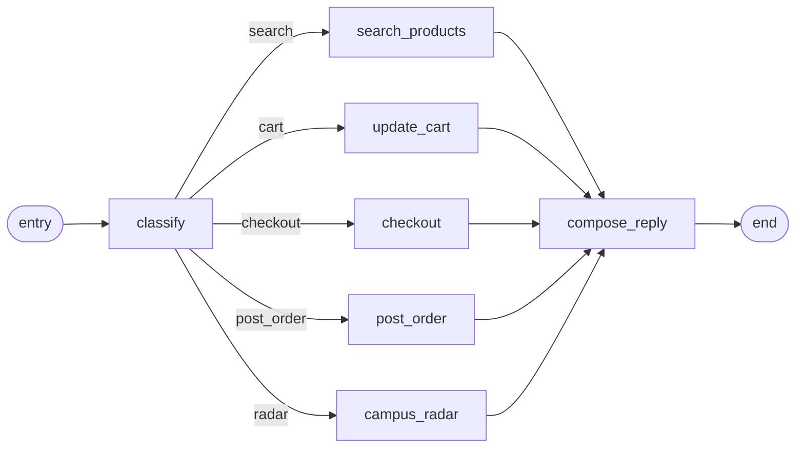
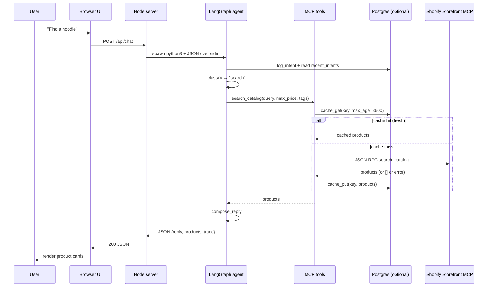
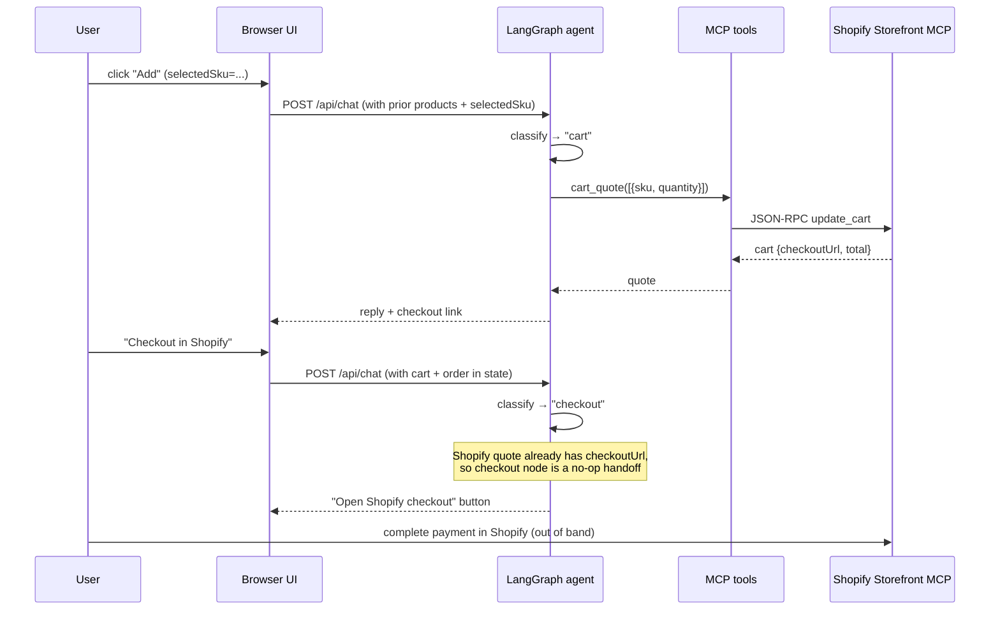
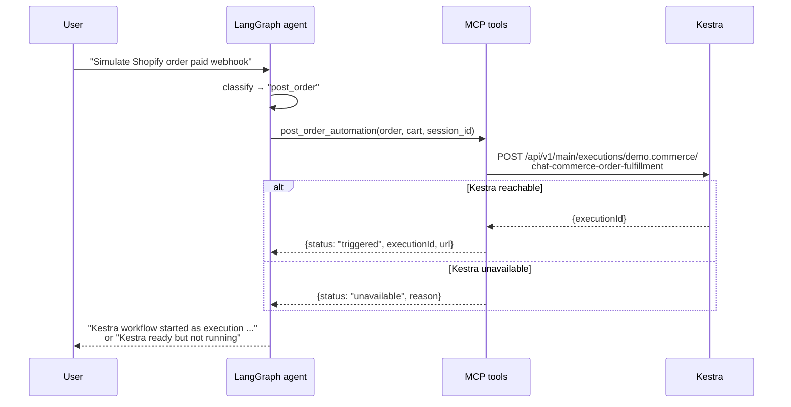
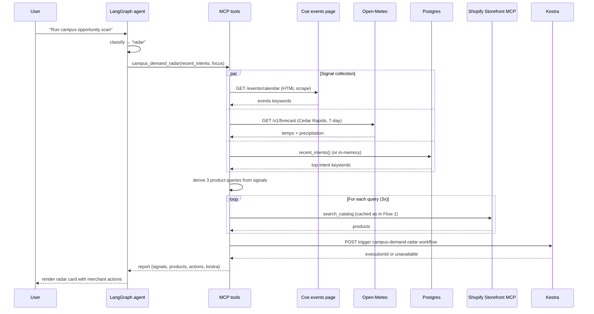

# Architecture

Deeper-dive companion to the [README](../README.md). Covers what concretely happens during the four main user flows, the LangGraph state machine layout, the MCP tool contracts, and the three design decisions worth knowing about.

## The big picture, in one sentence

A Node web server (`server.js`) serves a vanilla-JS chat UI and forwards each `POST /api/chat` to a freshly spawned Python LangGraph agent (`agent/commerce_agent.py`), which classifies intent, calls one or more in-process MCP tools (`agent/mcp/commerce_mcp_server.py`) — Shopify Storefront MCP, Coe events, Open-Meteo, Postgres, Kestra — and returns a structured reply.

## The LangGraph state machine

| Node | Job | MCP tool called |
|---|---|---|
| `classify` | Keyword/regex intent classifier; extracts `max_price` and tag constraints from the message | — |
| `search_products` | Catalog search | `search_catalog` |
| `update_cart` | Add the selected (or top-ranked) product to the cart and price it | `cart_quote` |
| `checkout` | Return the existing Shopify cart (with checkout URL), or mint a local demo order | `create_order` (local mode only) |
| `post_order` | Simulate the Shopify `orders/paid` webhook and trigger the Kestra fulfillment workflow | `post_order_automation` |
| `campus_radar` | Mash up campus events + weather + recent intent + Shopify products into merchant actions; trigger the Kestra radar workflow | `campus_demand_radar` |
| `compose_reply` | Format the user-facing reply text from the accumulated state | — |

### LangGraph vs. fallback

The graph runs as a real LangGraph `StateGraph` whenever the `langgraph` package is importable. That happens automatically:

- **In the Docker image** (used on Render): `Dockerfile` runs `pip install -r agent/requirements.txt` into a `/opt/venv`, and the deployed app's spawn picks up that interpreter via `PATH`.
- **Locally**: if `.venv/bin/python3` exists in the project root, `server.js` prefers it for the spawn. Create the venv once with `python3 -m venv .venv && .venv/bin/pip install -r agent/requirements.txt`. Otherwise the system `python3` is used and (without `langgraph` installed there) the deterministic fallback runs.

The fallback is not a degraded mode. It executes the same nodes in the same order with the same MCP calls — only the orchestration library differs. You'd notice the difference if we added LangGraph-specific features (streaming intermediate state, conditional cycles, checkpointed pauses, human-in-the-loop interrupts), none of which the current intent → tool → reply flow needs. The fallback exists to keep optional deps optional, not because we're hiding a degraded code path.

You can tell which path ran from the trace: a real LangGraph turn starts with `langgraph.StateGraph`; the fallback starts with `langgraph.fallback`.

Before each turn, `commerce_agent.main()` writes the message to `chat_intents` (when `DATABASE_URL` is set) and reads the most recent 15 intents back — that's how the radar gets real cross-session history.

## Flow 1: Search

User types `Find a hoodie`.

## Flow 2: Add to cart → checkout

User clicks **Add** on a product card, then types `Checkout in Shopify`.

In local-catalog mode the same path runs through `create_order` instead, which mints `ORD-DEMO-1001` and persists it to the `orders` table.

## Flow 3: Post-order automation

User clicks **Simulate order paid** (stand-in for a real Shopify webhook).

## Flow 4: Campus Demand Radar

User types `Run campus opportunity scan`. This is the most interesting flow — five external signals in one MCP call.

The output is a card with: source freshness per signal, three featured products, three suggested merchant actions, and a Kestra execution badge.

## MCP tool contracts

All five tools live in `agent/mcp/commerce_mcp_server.py`. They are callable both as direct Python imports (the agent's path) and over JSON-RPC stdin/stdout (the path an external MCP client like Claude Desktop would use).

| Tool | Inputs | Returns |
|---|---|---|
| `search_catalog` | `query: str`, `max_price?: number`, `tags?: string[]` | List of product dicts: `{sku, name, price, currency, inventory, rating, tags, description, url, imageUrl, source}` |
| `cart_quote` | `items: [{sku, quantity}]` | Local: `{lines, subtotal, shipping, tax, total}`. Shopify: `{source: "shopify", cart, checkoutUrl, total, lines}` |
| `create_order` | `items`, `shipping_method?`, `session_id?` | `{orderId, status, shippingMethod, quote, kestraWorkflow}` |
| `post_order_automation` | `order`, `cart`, `session_id` | `{orderId, status: "paid", source, total, kestraWorkflow, kestra: {status, executionId, url}}` |
| `campus_demand_radar` | `recent_intents?`, `focus?` | `{reportId, focus, generatedAt, signals: {events, weather, intent, products}, actions, featuredProducts, sourceSummary, kestraWorkflow, kestra}` |

## Design decisions worth knowing about

### 1. MCP tools as direct imports, JSON-RPC kept as a side door

The original implementation spawned a Python subprocess per tool call (the agent invoked `commerce_mcp_server.py` over stdin/stdout). That added 150–300 ms of startup per call; a typical chat fires 2–3 tool calls, so each request paid 500 ms – 1 s of pure subprocess overhead.

The agent now imports the tool functions directly. Each chat hits Python once (the per-request spawn from Node) instead of three times. The `commerce_mcp_server.py` `main()` is still wired up as a stdin/stdout JSON-RPC loop so external MCP clients (Claude Desktop, etc.) can call the same tools without code changes — the protocol surface didn't go away, only the in-app cost did.

The tradeoff is process isolation: a tool crash now crashes the agent. Acceptable for pure-Python tools with no native dependencies.

### 2. Per-query Postgres cache, 1-hour TTL

The cache key is a normalized `(shop, query, max_price, tags)` JSON blob; the value is the full Shopify response. Per-query is simpler than per-product (30 lines of code vs. 100) and is the natural unit of a Shopify search response.

The downside: the same product gets stored under multiple query keys. For the demo's traffic shape (a handful of distinct queries per session) the duplication is negligible. If we ever add inventory writes or a product detail page, the right next step is to refactor to per-product caching with a separate `query → product_ids` index.

TTL is configurable via `CATALOG_CACHE_TTL_SECONDS`. One hour is the right balance for a portfolio demo: prices and product names change rarely; inventory counts change faster, but the demo treats them as fuzzy ("available now") rather than exact.

### 3. Fallback chain: fresh cache → Shopify → stale cache → seed

The order matters. It encodes a specific belief about what "no answer" means at each step:

- **Fresh cache hit (< 1h old)**: trust it, return immediately.
- **Cache miss → call Shopify**: this is the canonical source. **An empty response is a real answer**, not a signal to keep falling back. If the Kohawk Shop genuinely has no "wedding invitation," we say so honestly. We even cache the empty result so we don't hammer Shopify on repeated misses.
- **Shopify errored or timed out**: now we degrade. Stale cache (any age) is preferred over the seed catalog because it's still real data from this store, just old.
- **No cache at all and Shopify is down**: the seed catalog (`data/seed_catalog.json`) is the lights-on fallback so the demo never returns a blank screen.

The earlier version of this code accidentally fell through to the seed catalog whenever Shopify returned `[]`, which silently substituted "Northline Trail Shoe" into a Kohawk Shop conversation. That bug shaped the current ordering: empty is honored as a real answer; only failure triggers degradation.
